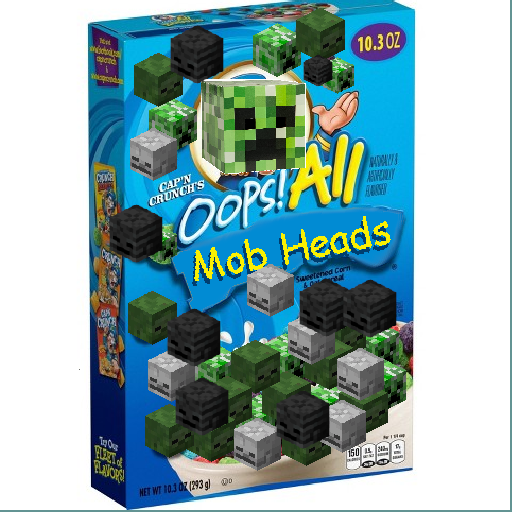
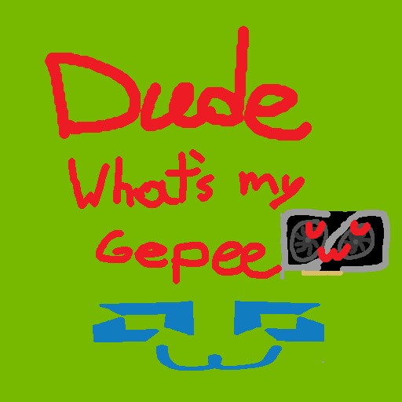
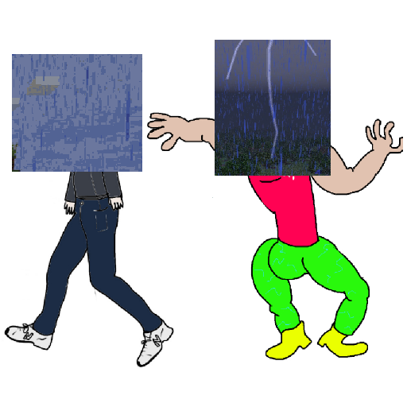

# Stew

  
  
  

This is a monorepo for Creeper Multidrop, DudeWhatsMyGePeUwu, RainBeThunder, and any other QOL tweaks/patches mods to be
used by devOS servers.

## Screenshots and Other Info

// TODO

## License
All projects are licensed under the [MIT license](LICENSE).